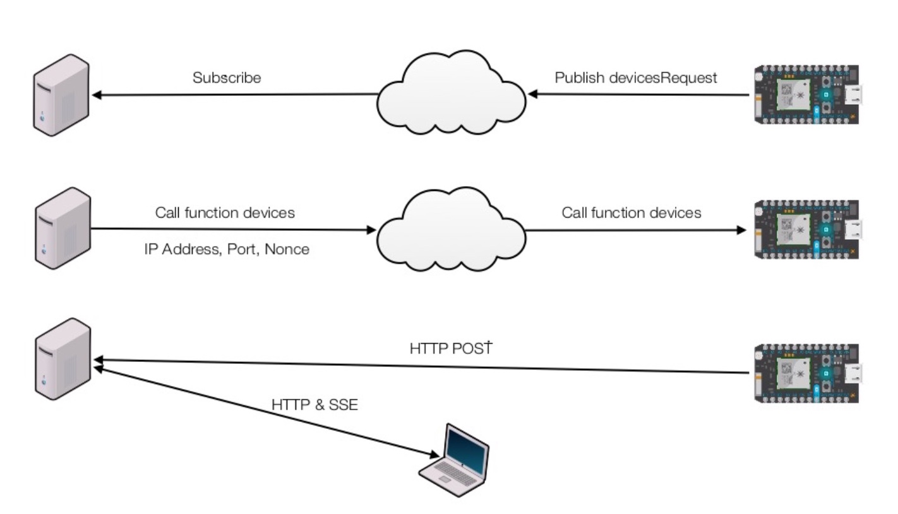
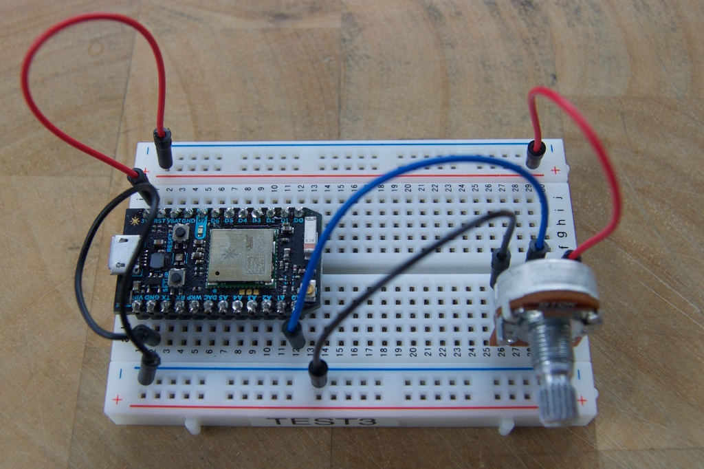
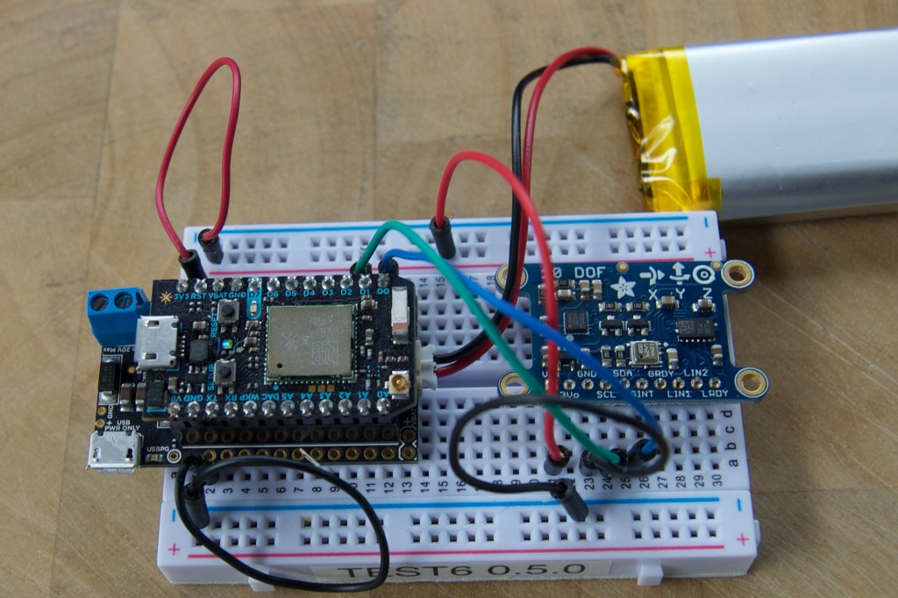

# localserver
*Sample node.js server for communicating with a Particle Photon*

The event publish and subscribe feature of the Particle Cloud is easy-to-use and very effective in most cases. But sometimes you need to transmit more data than is allowed for publishing events. Or maybe you need to do some specialized processing. A server on your home or office network implemented in node.js is a useful tool in some cases.

This sample implements:

* Server discovery. The Photon uses publish to locate the server IP address and port to connect to, so you don't need to hardcode it in your Photon firmware.
* A HTTP POST TCP connection from the Photon to the local server, kept open for sending data in real time.
* Authentication of the HTTP connection using a nonce (number used once).
* A small web server so you can easily host HTML, Javascript, CSS, etc. for a web-based application.
* A SSE (server-sent events) server to allow data to be streamed in real time into a web browser.

By using the combination of the HTTP/TCP connection and SSE, you can stream large amounts of data from a Photon in real time, right into a web browser, where it can be handled by Javascript code. Even better, any number of web browsers on your home network can connect at the same time and view the same live data, limited by the capacity of your node.js server, not the Photon. 

Also, unlike using webhooks, your local server does not need to be open for incoming connections from the Internet if your Photon is also on your local network. It can stay safely behind your home firewall and you don't need to worry about things like firewall/router port forwarding or dynamic DNS.

These are the three basic steps to connecting:



* The Photon publishes a private devicesRequest to the Particle cloud
* The server subscribes to these requests and responds by calling the devices function on the Photon with the server IP address, server port, and a nonce (number used once)
* The Photon issues a HTTP POST to the server IP address and port, with an Authorization header containing the nonce. It then keeps the connection open for sending data.

In the examples below we also use another computer web browser to connect to the server. It loads HTML, CSS, and Javascript from that server, and also opens a SSE channel. This channel is hooked to the HTTP POST channel from the Photon, basically allowing the Photon to send data in real time directly to the browser, via the server.

The server is just a computer running node.js. It could be running Windows, Mac OS X or Linux. It could even be something like a Raspberry Pi.

There are two examples here: 

* livegraph, which uses a simple potentiometer to graph values
* liveimu, which uses an accelerometer (IMU, Inertial Measurement Unit) and prints the location data to a web browser window in a scrolling table


## livegraph

This is a simple example that uses a potentiometer 



Wire up the Photon as shown. I have connected the outer connections of a 10K potentiometer to 3V3 and GND. (Any size >= 10K is fine, such as 50K or 100K, as well.) The center connection is connected to A0 (or any analog pin).

Flash the code in the livegraph/livegraph.ino file to the Photon.

Install the node prerequisites. From the top level of the localserver directory:

```
npm install particle-api-js yargs node-persist
```

If you don't have git installed, you may need to install that from [http://git-scm.com] (http://git-scm.com) as well.

Log into the Particle cloud:

```
node livegraph.js --login user@host.com password
```

Replace *user@host.com* with the account you log into Particle build with, and *password* with your password. The username and password are not saved; they are used to generate an access token which is saved in a file in the settings directory. 

You only need to do the prerequisites and login steps once.

Run the server:

```
node livegraph.js
```

It should respond with something like:

```
node livegraph.js
starting event stream listener
found address en0: 192.168.2.4
server running at http://192.168.2.4:8070/
```

In this example, you'd open in your browser: `http://192.168.2.4:8070/`. 

This example uses server-sent events, which are not supported in Internet Explorer or Edge. You should use a different browser for these examples. Also, you may want to open your web browser Javascript debug console, because messages are printed there.

Once you do, it may take up to 30 seconds for the Photon to connect. The timeout doesn't need to be that long, but it is in the example because otherwise when you're starting and stopping the node server during debugging your Photon serial log would be flooded with error messages.


## liveimu (a.k.a. live accelerometer)

Video Demonstration: 
[http://youtube.com/NC5X6hTPJmc] (http://youtube.com/NC5X6hTPJmc)



Wire up the Photon as shown. 

```
IMU  Photon
VIN  3V3
GND  GND
SCL  D1 (I2C SCL)
SDA  D0 (I2C SDA)
```

Flash the code in the liveimu/liveimu.ino file to the Photon. This example uses the [Adafruit 10-DOF IMU] (https://www.adafruit.com/products/1604) Breakout L3GD20H LSM303 BMP180 so you'll also need to include the `Adafruit_10DOF_IMU` library. It's in the community libraries in Particle Build, also also here on Github: [https://github.com/rickkas7/Adafruit_10DOF_IMU] (https://github.com/rickkas7/Adafruit_10DOF_IMU).

If you haven't already done so, install the node prerequisites. From the top level of the localserver directory:

```
npm install particle-api-js yargs node-persist
```

If you haven't already done so, log into the Particle cloud:

```
node livegraph.js --login user@host.com password
```

Replace *user@host.com* with the account you log into Particle build with, and *password* with your password. The username and password are not saved; they are used to generate an access token which is saved in a file in the settings directory.

The prerequisites and login are shared by livegraph and liveimu, so you only have to do that once.

Run the server:

```
node liveimu.js
```

It should respond with something like:

```
node livegraph.js
starting event stream listener
found address en0: 192.168.2.4
server running at http://192.168.2.4:8070/
```

In this example, you'd open in your browser: `http://192.168.2.4:8070/`.

This example uses server-sent events, which are not supported in Internet Explorer or Edge. You should use a different browser for these examples. Also, you may want to open your web browser Javascript debug console, because messages are printed there.

Once you do, it may take up to 30 seconds for the Photon to connect. The timeout doesn't need to be that long, but it is in the example because otherwise when you're starting and stopping the node server during debugging your Photon serial log would be flooded with error messages.

Now you should be able to move your Photon around and you'll see the list of position and acceleration information in your web browser window.

## Common code

Each server program (livegraph.js, liveimu.js) lives in a node.js file in the localserver directory. It has the initialization code to enable all of the modules it uses and hooks them together as necessary.

There are 5 different modules in the lib directory:

* cloud
* devices
* server
* setup
* sse

The cloud module handles connecting to the Particle cloud. It handles the command line --login option, getting an access token, and subscribing to events.

The devices module handles subscribing to the "devices" event and responding to the devicesRequest with a server IP address, port and nonce. It also authenticates and handles web server requests to upload data from the Photon to the server.

The server module handles the HTTP web server module, returning HTML, CSS and Javascript pages to the web browser. It also has a simple extension mechanism, used by devices and SSE to handle things that aren't pages. 

The server web pages are stored in a directory such as livegraph/public. That directory should contain the index.html file for the default page, and any other Javascript, CSS, image, etc. files that you need.

The sse module implements the server-sent events, used for sending data in real time to a web browser.


## Extending the code

This framework is quite flexible. You can make your own server by copying one of the top-level .js files and editing it. You can remove the features you don't need, and implement whatever you like in the rest of the file. 

The SSE module is fairly flexible and supports multiple channels, so you could have separate data feeds for multiple Photons connecting to a single server.

